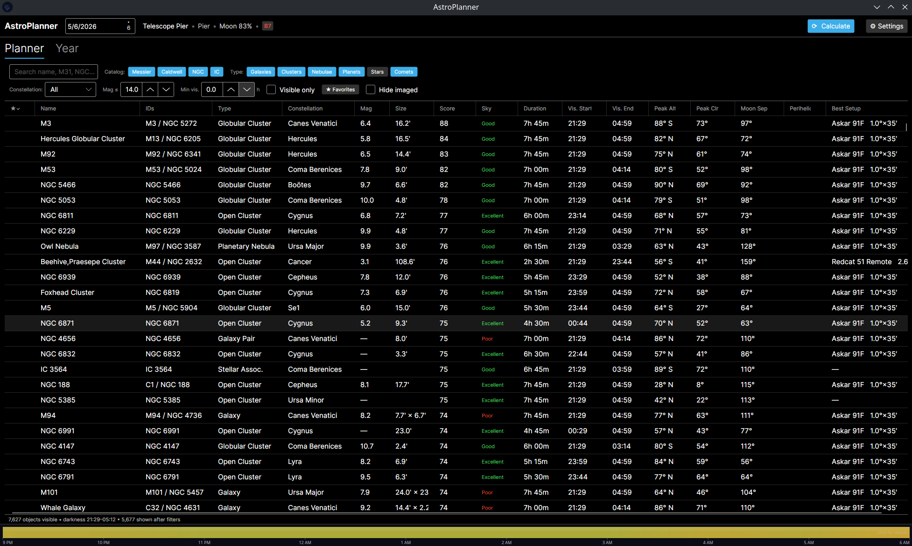
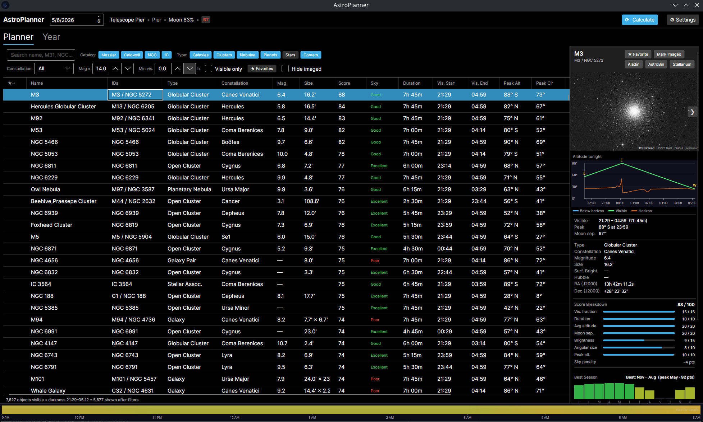
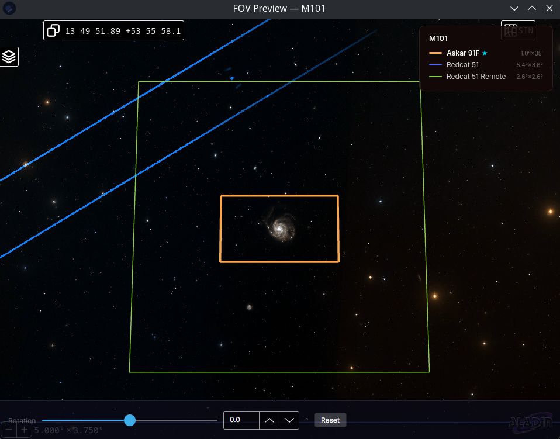
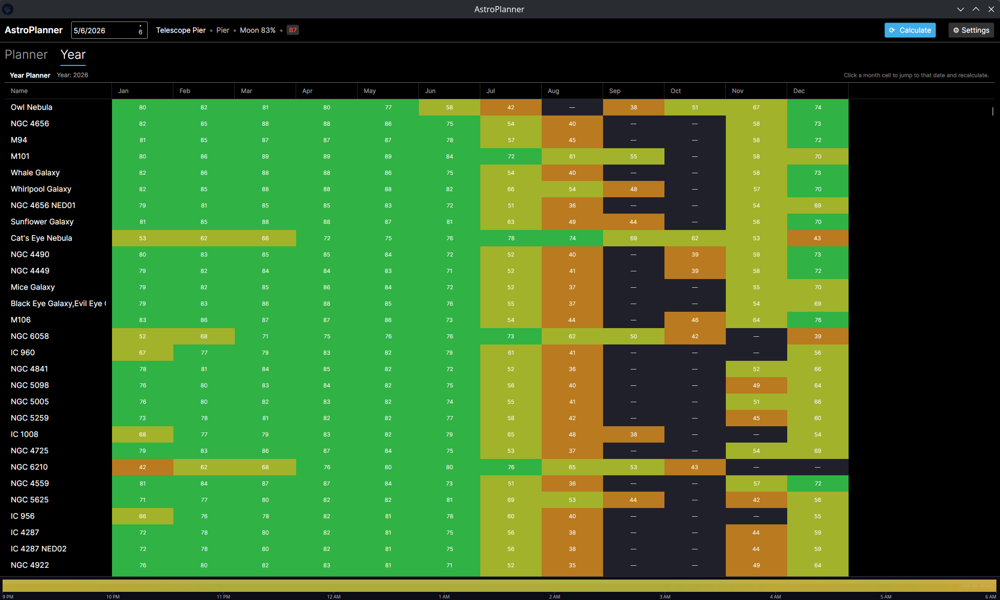

<div align="center">
  
  <h1>AstroPlanner</h1>
  <p>A horizon-aware deep sky object planner for visual observers and astrophotographers.</p>

  [](https://github.com/tankhardrive/AstroPlanner/releases/latest)
  [](#download)
  [](https://dotnet.microsoft.com)
  [](LICENSE)
</div>

---

## Screenshots

<div align="center">
  
  <br/><em>Horizon-aware object list with visibility scores</em>
  <br/><br/>
  
  <br/><em>Object detail — altitude plot, moon info, and imaging log</em>
  <br/><br/>
  
  <br/><em>Interactive FOV preview on real DSS imagery</em>
  <br/><br/>
  
  <br/><em>Yearly best-time heatmap</em>
</div>

---

## What it does

AstroPlanner tells you **what's worth observing tonight** and exactly how long you have to observe it. It loads the full NGC/IC/Messier/Caldwell catalog, computes each object's altitude throughout the night against your custom horizon profile, and scores every object based on how long it clears your horizon and your local sky conditions. Point it at a night, pick your location, and it hands you a ranked list you can actually trust.

## Features

### Planning
- **Horizon-aware visibility** — import a custom horizon profile (azimuth/altitude pairs) so the app knows about your tree line, rooftop, or observatory walls
- **Visibility scoring** — each object is scored by how long it clears your horizon at a useful altitude, weighted by sky quality
- **Yearly best-time view** — month-by-month heatmap showing the best observing windows for any object across the entire year
- **Observation date picker** — plan ahead for any night, not just tonight

### Catalog
- **NGC, IC, Messier, and Caldwell** objects from the embedded [OpenNGC](https://github.com/mattiaverga/OpenNGC) catalog
- **Solar system objects** — planets and the Moon with live positional data
- **Comet tracking** — fetches current bright comet data with real-time ephemerides
- **Filters** — narrow by object type (galaxies, nebulae, clusters, planets, comets), favorites, or visible-only

### Telescope & FOV
- **Imaging setup manager** — define multiple telescope + camera combinations with focal length, sensor size, and pixel scale
- **FOV Preview** — interactive sky view powered by [Aladin Lite](https://aladin.cds.unistra.fr/AladinLite/) with your FOV overlaid on real DSS imagery, rotatable to match your camera angle
- **Best setup suggestion** — automatically highlights the setup whose FOV best fits the target object

### Site & Sky
- **Multiple observation locations** — save and switch between sites with one click
- **Light pollution lookup** — fetches your Bortle class automatically from [lightpollutionmap.info](https://www.lightpollutionmap.info)
- **Weather integration** — hourly cloud cover, transparency, seeing, and wind from [Open-Meteo](https://open-meteo.com) and [7timer ASTRO](http://www.7timer.info)

### Object detail
- **Altitude plot** — full-night arc showing rise, transit, and set against your horizon
- **Moon interference** — moon phase and separation angle for the selected object
- **Favorites & imaging log** — mark objects as favorites or log the date you imaged them
- **Open in Stellarium** — one click sends the object to Stellarium's telescope view
- **AstroBin** — opens the object's AstroBin search page for reference images

---

## Download

Grab the latest build from the [Releases page](https://github.com/tankhardrive/AstroPlanner/releases/latest).

| Platform | File | Notes |
|---|---|---|
| Windows | `AstroPlanner-x.x-Setup.exe` | Installs to Program Files, adds Start Menu & desktop shortcuts |
| macOS | `AstroPlanner-x.x-macos.tar.gz` | Extract and run `AstroPlanner.app`. Right-click → Open on first launch to bypass Gatekeeper |
| Linux | `AstroPlanner-x86_64.AppImage` | `chmod +x AstroPlanner-x86_64.AppImage` then run |

---

## Built with

| | |
|---|---|
| **Language** | C# / .NET 10 |
| **UI framework** | [Avalonia UI](https://avaloniaui.net) — native cross-platform desktop |
| **Astronomy math** | [AASharp](https://github.com/jsauve/AASharp) — port of Jean Meeus' *Astronomical Algorithms* |
| **Sky viewer** | [Aladin Lite v3](https://aladin.cds.unistra.fr/AladinLite/) embedded via WebView |
| **Catalog** | [OpenNGC](https://github.com/mattiaverga/OpenNGC) (bundled) |
| **Weather** | [Open-Meteo](https://open-meteo.com) + [7timer ASTRO](http://www.7timer.info) |
| **Light pollution** | [lightpollutionmap.info](https://www.lightpollutionmap.info) |
| **MVVM** | [CommunityToolkit.Mvvm](https://github.com/CommunityToolkit/dotnet) |

---

## Building from source

Requires the [.NET 10 SDK](https://dotnet.microsoft.com/download).

```bash
git clone https://github.com/tankhardrive/AstroPlanner.git
cd AstroPlanner
dotnet run --project AstroPlanner/AstroPlanner.csproj
```

To publish for a specific platform:

```bash
dotnet publish AstroPlanner/AstroPlanner.csproj -c Release -r win-x64 --self-contained
dotnet publish AstroPlanner/AstroPlanner.csproj -c Release -r osx-x64 --self-contained
dotnet publish AstroPlanner/AstroPlanner.csproj -c Release -r linux-x64 --self-contained
```

Installer scripts are in the repo root (`installer.nsi` for Windows, `build-macos.sh` for macOS).

---

## Credits

Built by [tankhardrive](https://github.com/tankhardrive) with the help of [Claude Code](https://claude.ai/code) by Anthropic.
